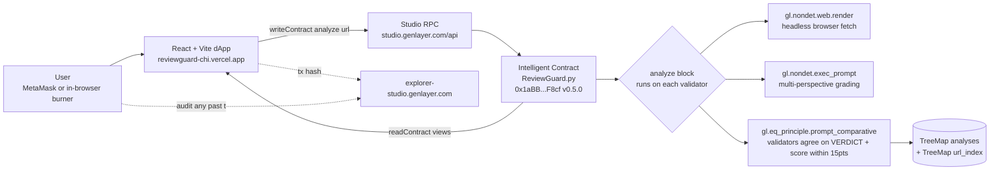
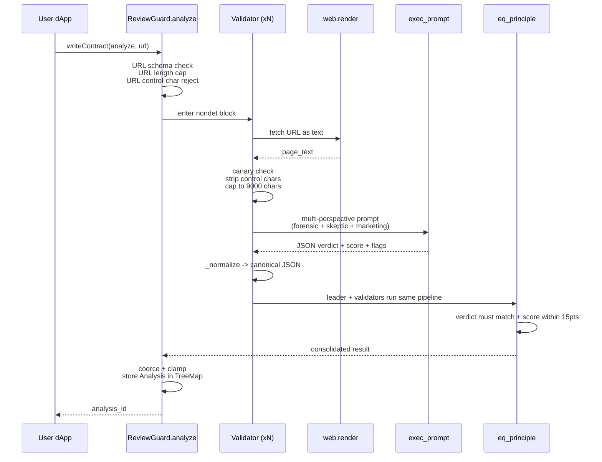
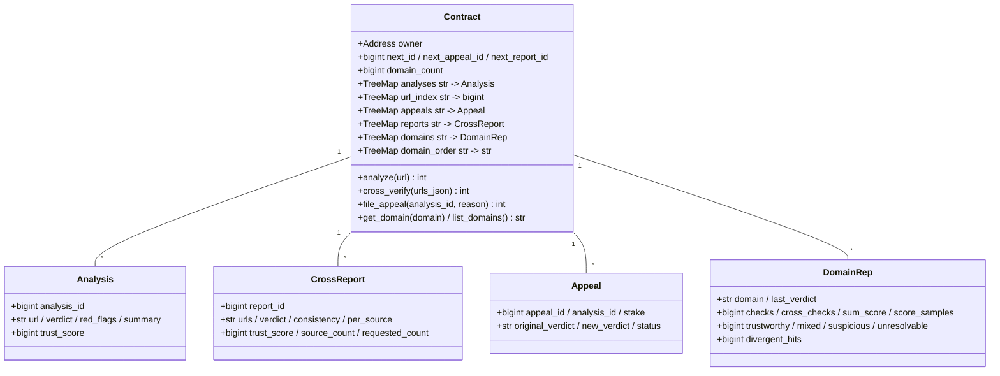

# Architecture — ReviewGuard

## System overview

ReviewGuard is a single Intelligent Contract on GenLayer studionet plus a
static React/Vite frontend on Vercel. There is no server-side component:
every judgement is produced by validator consensus during the on-chain
`analyze(url)` transaction.



## The `analyze()` pipeline

Every call to `analyze(url)` runs the following stages. Everything from
"non-deterministic block enters" through "consensus check" happens on
**each validator independently**, then the result is only written on-chain
if all validators agree.



## Contract storage layout



Every persisted integer is `bigint` (R14). Every `TreeMap` key is `str`
(R19). Each storage struct is `@allow_storage @dataclass` (R18). See
[SECURITY.md](./SECURITY.md) for the reasoning behind each choice.

## Beyond a single page (Phase 2–4)

The pipeline above describes `analyze()`. Three later milestones extend it,
all reusing the same `eq_principle.prompt_comparative` consensus surface:

- **Phase 2 — `file_appeal()`**: a payable write that re-runs the analysis under
  an *adversarial* prompt (the model is told the prior verdict and asked to
  overturn it), so a disputed verdict is re-decided by consensus, not by fiat.
- **Phase 3 — `cross_verify()`**: reads **2–5** review pages for the *same*
  product in one nondet block, grades each source, and adds a **cross-source
  consistency** judgement (`CONSISTENT` / `DIVERGENT` / `INSUFFICIENT`).
  Validators must agree on the overall verdict **and** the consistency label.
- **Phase 4 — reputation registry**: `analyze()` and each `cross_verify()`
  source fold into a persistent `DomainRep`, giving every domain a running
  verdict distribution, average trust score, divergent-cross-check count, and a
  derived tier (`TRUSTED` → `FLAGGED`). A DIVERGENT cross-check caps a domain at
  `WATCH`. Read back via `get_domain` / `list_domains`.

## Trust boundaries

| Layer | Trusted for | Not trusted for |
|---|---|---|
| **Frontend** | rendering, URL formatting | verdict integrity — never asked to verify |
| **RPC** | tx propagation | verdict correctness — every validator re-runs |
| **web.render** | fetching URL text | any content that comes back (see [SECURITY.md](./SECURITY.md)) |
| **exec_prompt** | linguistic judgement | resisting prompt injection alone — canary + fences + multi-perspective |
| **eq_principle** | verdict-level agreement | byte-identical output — deliberately not required |
| **Storage** | permanent record | mutation after write — records are append-only |

## Frontend layout

```
frontend/
  index.html               <-- meta tags, favicon, og:image
  public/
    logo.png               <-- circular aperture mark
    favicon.png
  src/
    main.jsx               <-- React root
    App.jsx                <-- 10 sections + navbar + footer
    genlayer.js            <-- createClient wrapper, view/write helpers
    styles.css             <-- forensics-dossier theme
  vercel.json              <-- build cmd + output dir
  vite.config.js           <-- vite-plugin-node-polyfills for genlayer-js
```

The React app is single-file for now; splitting sections into per-file
components is a candidate for a future Phase (Loại 5b architecture refactor).

## Repository layout

```
reviewguard/
  contracts/
    ReviewGuard.py         <-- Intelligent Contract v0.5.0
    storage_test.py        <-- minimal sanity contract (deploy first)
  tests/
    conftest.py            <-- session-scoped deploy fixture
    test_deploy_and_views.py
    test_url_validation.py
    test_analyze_edge_cases.py
    test_security_hardening.py    <-- Phase 1 additions
    test_appeal.py                <-- Phase 2 additions
    test_cross_verify.py          <-- Phase 3 additions
    test_reputation.py            <-- Phase 4 additions
  docs/
    ADR-0001-consensus-choice.md
  frontend/                <-- see above
  deliverables/            <-- Explorer submission bundle + logos
  scripts/deploy.js
  gltest.config.yaml
  pytest.ini
  CHANGELOG.md
  SECURITY.md
  ARCHITECTURE.md          <-- this file
  CONTRIBUTING.md
  README.md
```
